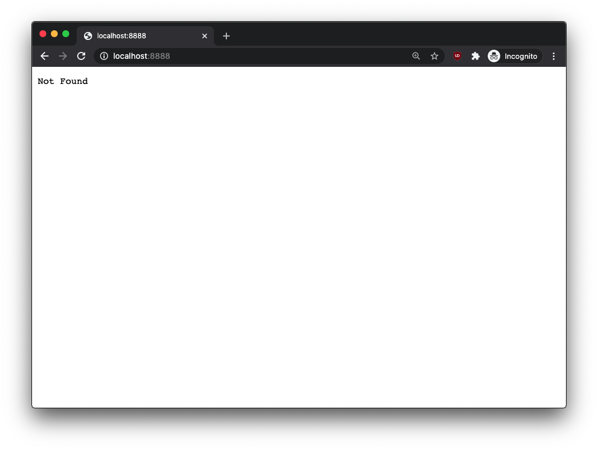
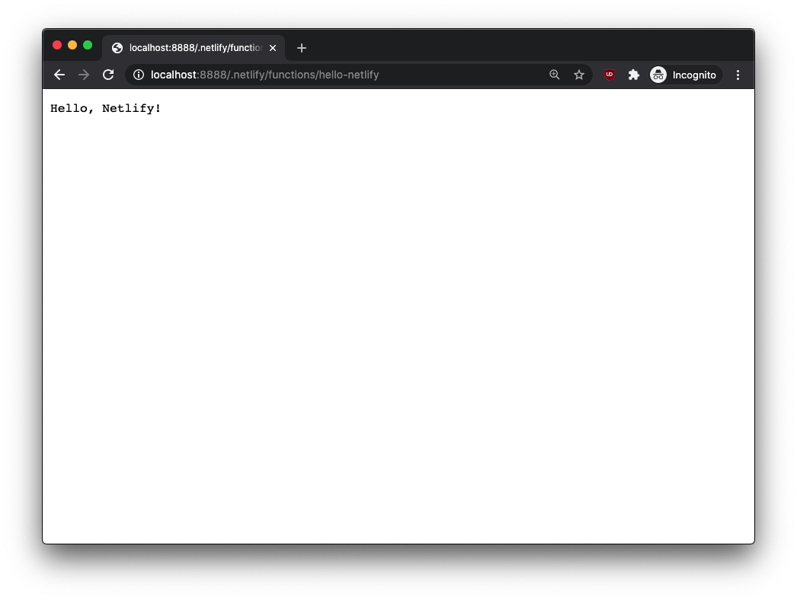
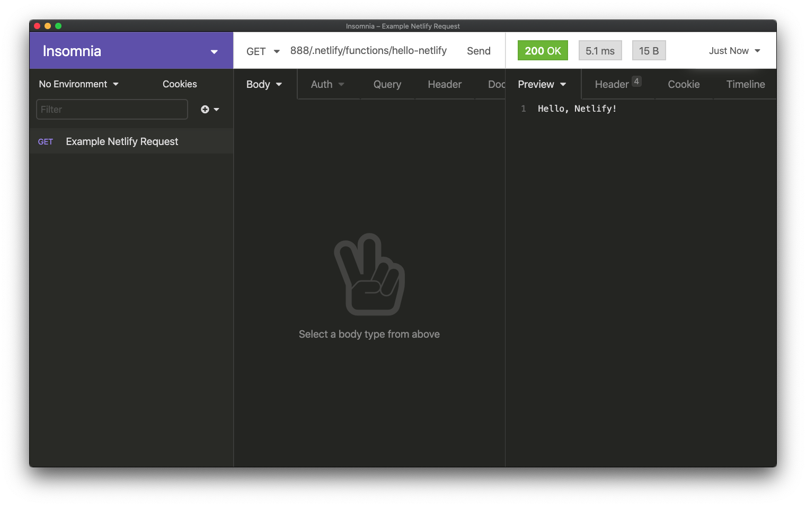
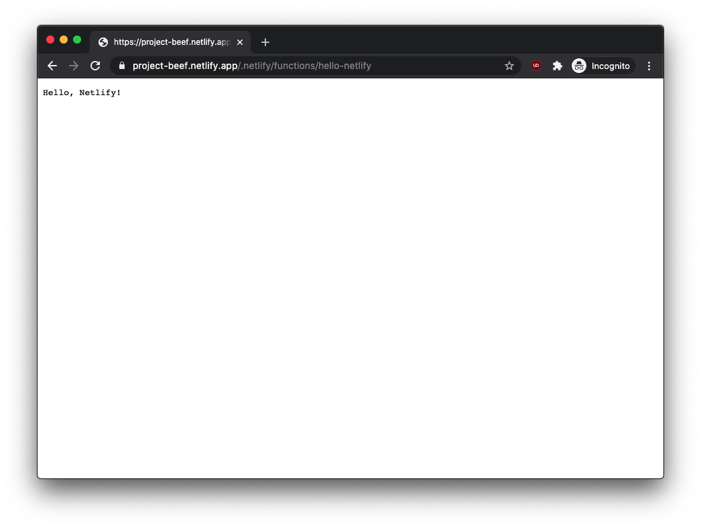

Netlify Functions are ways to write your Lambda functions with JavaScript and Go (and soon to be Rust in 2021 🦀).
You can use them for things like your own API, sanitizing input so you can do work with third-party APIs, or
or just have things fire during your builds. Lots left up to the imagination!

### Prerequisites

To make development and testing easier with Netlify, you'll want to have the [Netlify CLI][netlify-cli] installed,
and register an account with them. You will also want to be sure to have Node version 10 or higher installed.

<Callout>
**Note**: Turns out only Node version 10 or 12 are supported in Netlify Functions.
This is due to a [limitation of AWS Lambda][aws-limitations]. So be careful not to things
like [optional chaining][optional-chaining] yet. They will work locally, but not once you're on production!
</Callout>

To install the CLI, run this in your terminal:

```text
npm install netlify-cli
```

This will install the CLI tool globally so you can run it like any other script. From there,
you will want to be sure to login into your Netlify account through running the command:

```shell
netlify login
```

This should then launch a web window to ask for authorization for the CLI. Make sure
to click "Authorize":


And then in your terminal you should be all set:

```text
You are now logged into your Netlify account!

Run netlify status for account details

To see all available commands run: netlify help
```

### Setting up our Project and Configuration using `netlify.toml`

Now we can make a folder wherever to represent our project folder. In my case,
I will name it `project-beef` (super creative I know):

```shell
mkdir project-beef
cd project-beef
```

A thing that is helpful to do before writing your function is to write the configuration file first.
That's where `netlify.toml` comes in. This file tells Netlify what to do at certain times, how to build
our project, and any special variables or redirects we might want.

So create file in our project directory and call it `netlify.toml` with this contents:

```shell
# Inside of project-beef/netlify.toml

[build]
  functions = "functions"
```

This says: "When we're in the build step and looking for our functions, they will live in a folder called 'functions'".

Now we're all ready to create our first function!

### Create our Netlify Function Manually

Now in our project folder, we need to create a folder named `functions`. This will match what
the `netlify.toml` is looking for. And we can also create a file in there, let's name it `hello-netlify.js`.
This will represent our function!

```js
// inside `project-beef/functions/hello-netlify.js
exports.handler = async (event) => {
  return {
    statusCode: 200,
    body: "Hello, Netlify!"
  }
}
```

<details>
  <summary className="text-lg" dangerouslySetInnerHTML={{ __html: "This function when we run it will return us the value: \"Hello, Netlify!\". If you're interested in more detail on how this works, feel free to click on this text to expand\."}}/>
  
  Netlify Functions uses CommonJS to export and import functions. So here Netlify is expecting to
  run a function named `handler` from our file. Netlify recommends using the `async` syntax so
  that way it returns as a promise for our end-users (those consuming our function).

  The first parameter in our function, `event`, represents data you're receiving from our user as an object.
  There are keys in there such as `body`, `headers`, `queryStringParameters`, and much more.

  When we're ready to send our data back to the person calling our function, we want to return an object,
  that sends at least a `statusCode` and you're also able to send a `body`. Here we tell our end user the server
  received the message and it was OK (which matches to HTTP server code 200), and we're sending back
  the text "Hello, Netlify!".
</details>

Now that our function is written, we can test it!

### Test our Netlify Function with the Netlify CLI

With our function written, now it is time to test it. We can do this without even leaving our local computer!

In our terminal in the project root, `project-beef`, we can run:

```shell
netlify dev
# or for short
ntl dev
```

This should spin up a local server that you could use to even test your
local Netlify site. However, since we don't have a site, when the web browser
opens up you might see this instead:



Don't fret it still is working! The function is just going to respond
fine to any request, so navigate instead to `http://localhost:8888/.netlify/functions/hello-netlify`.
You should see this instead now!



If your function is a bit more complex, you might want to consider using a HTTP Client like,
[Insomnia][insomnia-client] or [Hoppscotch (previously Postwoman)][hoppscotch-client] where you
can also test your request:



And now we can verify our function will work before putting it onto the Web! Definitely recommend this always.

### Publishing our Netlify Function

Now that we've created and tested our function, we're ready to publish it for our use on the Internet.
Once again, Netlify does a great job making it easy for us to go through this entire process through
just their CLI.

In our terminal we shall run:

```shell
netlify deploy --prod
```

Once we do that we'll be guided through an interactive flow that let's us choose whether or not
to link our project to an existing site or a new one, what team it is for and what the name of our site will be.
Select "Create & configure a new site", your team, and feel free to name the site whatever you like. In my case,
I'll say "project-beef".

```text
ntl deploy --prod
This folder isn't linked to a site yet
? What would you like to do?
  Link this directory to an existing site
❯ +  Create & configure a new site

? Team: (Use arrow keys)
❯ Prince's team

Choose a unique site name (e.g. maxcell-makes-great-sites.netlify.app) 
or leave it blank for a random name. You can update the site name later.
? Site name (optional): project-beef
```

From there, you should be told that your site was created and then we just
need to make sure our configuration is all set up for deployments. You can
leave everything here as defaults by just pressing <kbd>Enter</kbd> / <kbd>Return</kbd>:

```text
Site Created

Admin URL: <YOUR_ADMIN_URL>
URL:       https://project-beef.netlify.app
Site ID:   <YOUR_SITE_ID>
Please provide a publish directory (e.g. "public" or "dist" or "."):
/<PATH_TO_PROJECT>/project-beef
? Publish directory (.)
```

Then you should see it was successfully deployed.

```text
Deploy path:        /<PATH_TO_PROJECT/project-beef
Configuration path: /<PATH_TO_PROJECT>/project-beef/netlify.toml
Deploying to main site URL...
✔ Finished hashing 2 files
✔ CDN requesting 0 files
✔ Finished uploading 0 assets
✔ Deploy is live!

Logs:              https://app.netlify.com/sites/project-beef/deploys/<DEPLOY_ID>
Unique Deploy URL: https://<DEPLOY_ID>--project-beef.netlify.app
Website URL:       https://project-beef.netlify.app
```

And now similar to our local development, if we just go to [https://project-beef.netlify.app](https://project-beef.netlify.app),
we won't see anything. That's because we don't have a site built. Instead, let's go to our function
URL instead, `https://project-beef.netlify.app/.netlify/functions/hello-netlify`, and we would see:




### Conclusion

And that's how we create, test, and publish a Netlify Function! I hope that this is helpful 
for you and you get to build your own functions.

Shoutout to the folks at Netlify for making this happen. Also shoutout to [Xander][xander-twitter] for proof-reading!

[netlify-cli]: https://github.com/netlify/cli
[aws-limitations]: https://docs.aws.amazon.com/lambda/latest/dg/lambda-runtimes.html
[optional-chaining]: https://developer.mozilla.org/en-US/docs/Web/JavaScript/Reference/Operators/Optional_chaining
[insomnia-client]: https://insomnia.rest/
[hoppscotch-client]: https://hoppscotch.io/
[xander-twitter]: https://twitter.com/XandyDandy