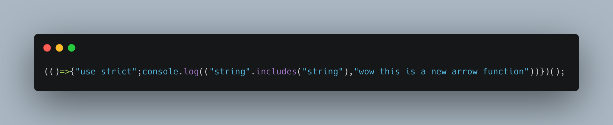
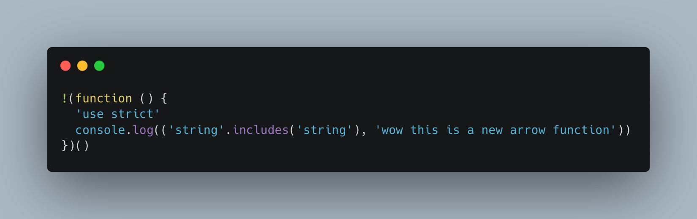

Like many Webpack 5 projects, it is common to add in loaders such as
`babel-loader`. These tools are typically something that can help process
files for your application and added to the graph what things depend on each other.

## Problem

However, I learned that `babel-loader` right out of the gate isn't going
to compile your code down to the browsers you need it for without it explicitly
targetting it. Here's how I came acrossed it and solved it with `browserslist`.

## Background

For my first custom Webpack configuration I wanted to start with a common path:
I wanted to make sure I understood how Babel gets added to Webpack and compiles
my code. I ended up adding it to my devDependencies with `npm i -D babel-loader`.
In order for my Webpack to understand that it should consume this new loader,
we need to add it to to our `module.rules`:

```diff
const path = require("path")

module.exports = {  
  mode: "production",
  entry: './src/index.js',
  output: {
    path: path.resolve(__dirname, 'dist'),
    filename: 'app.bundle.js'
  },
+  module: {
+    rules: [
+      {
+        test: /.m?js$/,
+        exclude: /(node_modules)/,
+        loader: 'babel-loader',
+        options: {
+          presets: ['@babel/preset-env']
+        }
+      }
+    ]
+  }
}
```

To be brief about these additions:

- `module.rules` says we can expect multiple loaders each for their own task
- `test` is a way for us to see which files we need to operate
- `exclude` says ignore files that fall under this condition
- `loader` represents the loader we're trying to use
- `option` speaks to any configurations we need to make for our loader.
  In our case, we want to make sure to specific how babel should handle compile using the preset.

When I put this in and ran Webpack, I noticed the output looked
exactly the same way it was before without any Babel step. 



This made me curious: "Does this mean it isn't working?". After some
trial and error, I went to Twitter to ask about it and a colleague
mentioned that I was missing my [`browerslist`](https://github.com/browserslist/browserslist).

The `browserslist` is a way to specify targets for browsers or node for
frontend tools! You can add this either through
the explicit `.browserslistrc` file, or more commonly, add it into your
`package.json`. Otherwise, Babel may not try to actually compile it down
to the environments you'd expect. And that's exactly what was happening
for me!

So in my `package.json` I targeted greater than 0.25% of browser versions that aren't dead:

```diff
{
  "name": "example-full-repo",
  "version": "0.1.0",
  "description": "This is going to represent following through the Modern JavaScript Tooling with React course by Andy Van Slaars.",
  "main": "index.js",
+  "browserslist": "> 0.25%, not dead",
  // rest of the file ...
```

Once I did that, it seems as though Babel recognizes: "Oh hey, I am no longer
targeting nothing, I should make sure that this JavaScript compiles down
to the browsers it might get used on."




Thank you [Rob for sleuthing this down](https://twitter.com/robcobbable/status/1421153958962343945?s=20)!
With this written down, hopefully I won't come across a bug like this again.
And it will serve as a good archive for others who might come across this
same problem on their webpack learning journey!