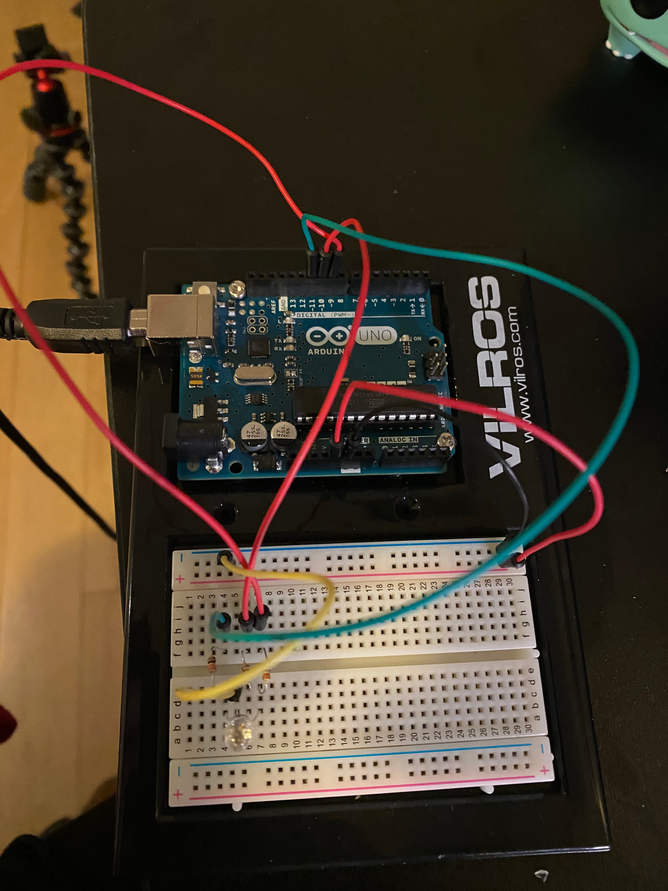

On my first stream of the new year (2021), I ended up having a new camera
and I realized that it could zoom in. I thought and said
"Wouldn't it be cool to have a little switch that could do the Zoom so I
could turn it and it would zoom in?" This was an ambitious goal so
for now to learn I decided to take a step back and learn how to work with
and RGB LED and understand more about the code.

I'm going to break this down into two parts: 1) how I setup up the hardware
and 2) how I setup the software.

### Hardware

#### Prequisites

The material I used:

- Arduino Uno
- Breadboard (Standard Soderless)
- Wires (6, at least)
- RGB LED
- Resistor (3, 330 Ohm)

Here is a photo of the final product:



#### Setting up the Board

If you've never done the wiring for a board before or wanted to have a written copy of what
I did in the photo, this is for you!

I put the RGB LED into slots C4, C5, C6, and C7. When putting in the RGB LED
I wanted to be sure that the longest leg (which represents ground, GND) is in
C5. Every other leg represents Red (C4), Green (C6), and Blue (C7).

From there, I took my resistors in the same row as each leg that represents RGB, where the orange 
strips were facing towards the RGB LED and the grey and black were facing away. Because you can only
connect so many parts in a terminal row together, I split my resistors across the two terminal strips so I can
have additional wiring and not feel too cramp.

On the second terminal strip, I place wires next to each resistor and connected them to
digital PWM pins (D11 - D9). So when dealing with Red, that would go from H4 to DP11 (on the arduino).
Blue would go from H6 to DP10 and Green would go from H7 to DP9. 

To get power all set up, I put a wire into GND and on the bus strip opposite of where I put the LED.
Once it goes into the negative column it wires up that entire column. Before putting in the power, I also
connected a wire from the GND column I hooked up to E5 so the LED would have its GND leg connected. Then the
last wire before it is all set up is the 5V to the positive bus strip.

From there, it is all hooked up and so I plugged my Arduino into my computer so when I finish
writing the program, I can just immediately flash it and get the program on there.


### Software

When writing a program using the `avr-hal` crate, it means that we don't need to use the 
standard library and we will disable emitting a main symbol for our binary (though still)
have a main function.

```rust
#![no_std]
#![no_main]

fn main() -> ! {

}
```

We'll then make sure to add in our `arduino_uno` package and `panic_halt`. `panic_halt` helps
direct what should happen if we panic so not to completely destroy all our work. When we have
these two packages we will want to add an attribute to our function so to indicate where the 
entry point for the program should be.

```rust {4,5,7}
#![no_std]
#![no_main]

use arduino_uno::prelude::*;
use panic_halt as _;

#[arduino_uno::entry]
fn main() -> ! {

}
```

From there, we can grab in our peripherals from `arduino_uno` and create
an instance of the pins. We will also want to have a `loop` which is necessary for
an Arduino program but doesn't need to contain anything in it:

```rust
// ...
fn main () -> ! {
  let peripherals = arduino_uno::Peripherals::take().unwrap();
  let pins = arduino_uno::Pins::new(peripherals.PORTB, peripherals.PORTC, peripherals.PORTD);

  loop {}
}
```

We're going to activate the digital pins that we need, which were the digital pins 9-11. We're going
to be sure they act as the output pins but then also transform them into using PWM. That way we can
control the variability of power we need to send so it can adjust the brightness of any of them.

```rust {6-15}
// ...
fn main () -> ! {
  let peripherals = arduino_uno::Peripherals::take().unwrap();
  let pins = arduino_uno::Pins::new(peripherals.PORTB, peripherals.PORTC, peripherals.PORTD);

  let mut pwm_timer2 =
      arduino_uno::pwm::Timer2Pwm::new(peripherals.TC2, arduino_uno::pwm::Prescaler::Prescale64);
  let mut pwm_timer1 =
      arduino_uno::pwm::Timer1Pwm::new(peripherals.TC1, arduino_uno::pwm::Prescaler::Prescale64);
  let mut red_pin = pins.d11.into_output(&pins.ddr).into_pwm(&mut pwm_timer2);
  let mut green_pin = pins.d10.into_output(&pins.ddr).into_pwm(&mut pwm_timer1);
  let mut blue_pin = pins.d9.into_output(&pins.ddr).into_pwm(&mut pwm_timer1);
  red_pin.enable();
  green_pin.enable();
  blue_pin.enable();

  loop {}
}
```

This will make sure that all your pins are turned on and ready to be set for duty! `set_duty`
allows you to set a value of 0-255 for the LED, anything more than that won't get registered:

```rust {17}
// ...
fn main () -> ! {
  let peripherals = arduino_uno::Peripherals::take().unwrap();
  let pins = arduino_uno::Pins::new(peripherals.PORTB, peripherals.PORTC, peripherals.PORTD);

  let mut pwm_timer2 =
      arduino_uno::pwm::Timer2Pwm::new(peripherals.TC2, arduino_uno::pwm::Prescaler::Prescale64);
  let mut pwm_timer1 =
      arduino_uno::pwm::Timer1Pwm::new(peripherals.TC1, arduino_uno::pwm::Prescaler::Prescale64);
  let mut red_pin = pins.d11.into_output(&pins.ddr).into_pwm(&mut pwm_timer2);
  let mut green_pin = pins.d10.into_output(&pins.ddr).into_pwm(&mut pwm_timer1);
  let mut blue_pin = pins.d9.into_output(&pins.ddr).into_pwm(&mut pwm_timer1);
  red_pin.enable();
  green_pin.enable();
  blue_pin.enable();

  red_pin.set_duty(255);
  loop {}
}
```

And this will allow you to see only red!